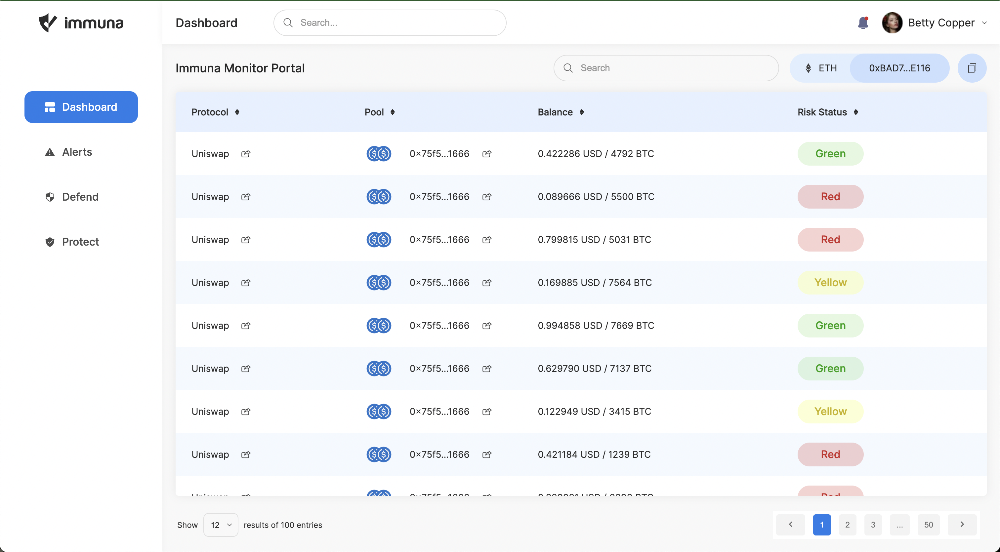

# Immuna front end challenge

## Setup
1. Run `npm install` in the root directory after cloning the project.
2. Add a `.env.local` file in the rool directory and add the API key like so `COINMARKET_KEY=eddf8abb-ac98-4931-9559-afb222e1db84`
3. Run the project with `npm run dev`